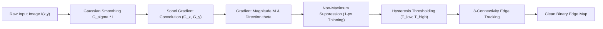
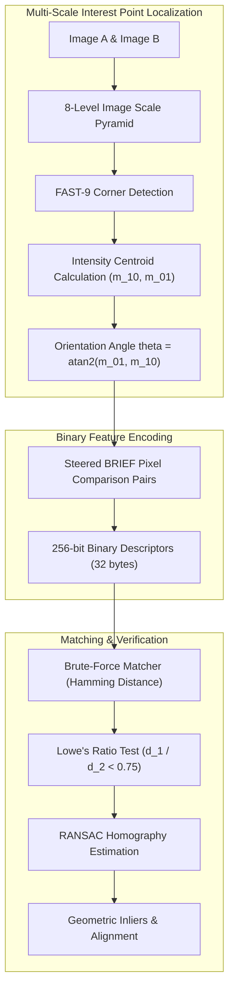
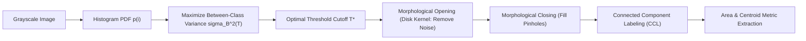

<div align="center">

# Computer Vision Essentials & Algorithmic Portfolio

[](https://www.python.org/)
[](https://opencv.org/)
[](https://www.mathworks.com/products/matlab.html)
[](https://github.com/psf/black)
[](http://mypy-lang.org/)
[](LICENSE)

A modular, production-grade learning repository and portfolio demonstrating core **Classical Image Processing**, **Mathematical Morphology**, **Feature Matching**, and **Computer Vision** algorithms implemented in both **Python / OpenCV** and **MATLAB**.

</div>

---

## Table of Contents

- [Overview & Architecture](#overview--architecture)
- [Algorithmic Pipelines & Mermaid Flowcharts](#algorithmic-pipelines--mermaid-flowcharts)
  - [1. Edge Detection & Gradient Pipeline](#1-edge-detection--gradient-pipeline)
  - [2. Feature Extraction & Robust Matching (ORB + RANSAC)](#2-feature-extraction--robust-matching-orb--ransac)
  - [3. Otsu Thresholding & Morphological Segmentation](#3-otsu-thresholding--morphological-segmentation)
  - [4. Marker-Controlled Watershed Pipeline](#4-marker-controlled-watershed-pipeline)
- [Repository Structure](#repository-structure)
- [Quick Start Guide](#quick-start-guide)
  - [Python Environment Setup](#python-environment-setup)
  - [Running Python CLI Demos](#running-python-cli-demos)
  - [Running MATLAB Implementations](#running-matlab-implementations)
- [Core Mathematical Formulations](#core-mathematical-formulations)
- [In-Depth Study Guides](#in-depth-study-guides)
- [Engineering Standards](#engineering-standards)

---

## Overview & Architecture

Computer Vision transforms raw optical sensor signals into semantic interpretations. This repository bridges theoretical mathematical foundations with clean, type-annotated, modular implementations:

- **Modular Python Architecture (`cv_portfolio/`)**: Packaged into specialized namespaces (`preprocessing`, `filtering`, `segmentation`, `features`, `detection`, `visualization`, `utils`) complying with **PEP 8**, strict **type hints (`typing`)**, and comprehensive **NumPy/Google docstrings**.
- **Self-Contained Standalone Demos (`src/python/opencv/`)**: CLI tools supporting user images with procedural **synthetic test pattern generation** so every demo executes immediately out-of-the-box.
- **Structured MATLAB Scripts (`src/matlab/`)**: Clean function and script files featuring standard H1 headers, theoretical summaries, and figure visualizers.

---

## Algorithmic Pipelines & Mermaid Flowcharts

### 1. Edge Detection & Gradient Pipeline



### 2. Feature Extraction & Robust Matching (ORB + RANSAC)



### 3. Otsu Thresholding & Morphological Segmentation



### 4. Marker-Controlled Watershed Pipeline


---

## Repository Structure

```text
Computer-Vision-Essentials/
├── .editorconfig                          # Cross-editor formatting rules
├── .gitignore                             # Git exclusion for Python/MATLAB
├── pyproject.toml                         # Modern Python packaging configuration
├── requirements.txt                       # Pinned Python dependencies
├── README.md                              # Main portfolio documentation
│
├── docs/                                  # Theory notes & comprehensive study guides
│   ├── guides/
│   │   ├── 01_image_fundamentals_and_enhancement.md
│   │   ├── 02_spatial_filtering_and_edge_detection.md
│   │   ├── 03_segmentation_and_morphology.md
│   │   ├── 04_features_descriptors_and_matching.md
│   │   └── 05_classical_object_detection.md
│   ├── lessons/                           # Lecture summaries & curriculum notes
│   ├── portfolio/                         # Portfolio translation & mini-project notes
│   └── tp/                                # Practical session problem statements
│
├── reports/                               # Formal laboratory session reports
│   ├── tp-01-report.md                    # TP1: Image fundamentals & transformations
│   ├── tp-02-report.md                    # TP2: Histograms, filtering & edge detection
│   ├── tp-03-report.md                    # TP3: Thresholding & morphology
│   └── tp-04-report.md                    # TP4: Feature extraction & matching
│
└── src/
    ├── python/
    │   ├── cv_portfolio/                  # Modular, reusable Python package
    │   │   ├── __init__.py                # Package root exports & API
    │   │   ├── utils/                     # I/O, format conversion & test generators
    │   │   ├── preprocessing/             # Histogram eq, CLAHE, gamma & color
    │   │   ├── filtering/                 # Gaussian, box, bilateral, Sobel, Canny
    │   │   ├── segmentation/              # Otsu, adaptive, morphology, watershed
    │   │   ├── features/                  # Harris, Shi-Tomasi, FAST, ORB, contours
    │   │   ├── detection/                 # Haar cascades, template match, counting
    │   │   └── visualization/             # Multi-panel diagnostic plotting
    │   │
    │   └── opencv/                        # Standalone executable CLI demos
    │       ├── edge_detection_comparison.py
    │       ├── image_enhancement_toolkit.py
    │       ├── image_segmentation_demo.py
    │       ├── feature_matching_demo.py
    │       ├── face_detection_project.py
    │       ├── object_counting_application.py
    │       ├── webcam_filters.py
    │       ├── watershed_segmentation_demo.py
    │       └── corner_detection_demo.py
    │
    └── matlab/                            # Aligned MATLAB scripts & demo functions
        ├── tp1_image_basics.m
        ├── tp2_histogram_edges.m
        ├── tp3_segmentation_morphology.m
        ├── tp4_feature_matching_detection.m
        ├── edge_detection_comparison.m
        ├── image_enhancement_toolkit.m
        ├── image_segmentation_demo.m
        ├── feature_matching_demo.m
        └── object_detection_demo.m
```

---

## Quick Start Guide

### Python Environment Setup

1. **Clone the repository and create a virtual environment:**
   ```bash
   git clone https://github.com/your-username/Computer-Vision-Essentials.git
   cd Computer-Vision-Essentials
   python -m venv .venv
   ```

2. **Activate the virtual environment:**
   - **Windows (PowerShell):**
     ```powershell
     .\.venv\Scripts\Activate.ps1
     ```
   - **Linux / macOS:**
     ```bash
     source .venv/bin/activate
     ```

3. **Install dependencies:**
   ```bash
   pip install -r requirements.txt
   ```

4. **(Optional) Install the package in editable mode:**
   ```bash
   pip install -e .
   ```

---

### Running Python CLI Demos

All demos run out of the box with zero external asset dependencies (procedural test patterns are synthesized automatically if no image path is passed):

```bash
# 1. Edge Detection Comparison (Sobel, Prewitt, Scharr, Laplacian, LoG, Canny)
python src/python/opencv/edge_detection_comparison.py --save-plot outputs/edges.png

# 2. Image Enhancement & Dynamic Range Processing (Hist Eq, CLAHE, Gamma)
python src/python/opencv/image_enhancement_toolkit.py --save-plot outputs/enhancement.png

# 3. Otsu Thresholding & Connected Component Analysis
python src/python/opencv/image_segmentation_demo.py --save-plot outputs/segmentation.png

# 4. ORB Feature Extraction & Correspondence Matching with Lowe's Ratio Test
python src/python/opencv/feature_matching_demo.py --save-plot outputs/matching.png

# 5. Marker-Controlled Watershed for Touching Objects
python src/python/opencv/watershed_segmentation_demo.py --save-plot outputs/watershed.png

# 6. Viola-Jones Face & Eye Detection Cascade
python src/python/opencv/face_detection_project.py --save-plot outputs/face_detection.png

# 7. Real-Time Video Filter Transformation Gallery
python src/python/opencv/webcam_filters.py --save-plot outputs/webcam_filters.png
```

---

### Running MATLAB Implementations

1. Launch MATLAB and set the Current Folder to `src/matlab/`.
2. Run any TP script or demo function directly in the Command Window:
   ```matlab
   % Run Practical Sessions
   tp1_image_basics
   tp2_histogram_edges
   tp3_segmentation_morphology
   tp4_feature_matching_detection

   % Or call modular demo functions
   res = edge_detection_comparison('cameraman.tif');
   seg = image_segmentation_demo('coins.png');
   feat = feature_matching_demo();
   ```

---

## Core Mathematical Formulations

| Concept | Mathematical Equation | Description |
| :--- | :--- | :--- |
| **2D Convolution** | $(f * g)(x,y) = \sum_i \sum_j f(i,j)g(x-i, y-j)$ | Discrete spatial filtering across spatial window |
| **Gaussian Kernel** | $G(x,y) = \frac{1}{2\pi\sigma^2} \exp\left(-\frac{x^2+y^2}{2\sigma^2}\right)$ | Linear isotropic low-pass smoothing filter |
| **Gradient Magnitude** | $\|\nabla I\| = \sqrt{G_x^2 + G_y^2}$ | Directional intensity variation magnitude |
| **Gamma Correction** | $s = c \cdot r^\gamma$ | Non-linear dynamic range tone curve |
| **Otsu Variance** | $\sigma_B^2(T) = \omega_0(T)\omega_1(T)[\mu_0(T) - \mu_1(T)]^2$ | Optimal bimodal threshold criterion |
| **Harris Response** | $R = \det(M) - k \cdot (\mathrm{trace}(M))^2$ | Interest point corner detection metric |
| **Hamming Distance** | $d_H(a, b) = \mathrm{popcount}(a \oplus b)$ | Bitwise distance for binary descriptors |
| **Circularity** | $C = \frac{4\pi \cdot \mathrm{Area}}{\mathrm{Perimeter}^2}$ | Compactness metric for shape classification |

---

## In-Depth Study Guides

Detailed reference guides featuring mathematical proofs, LaTeX equations, complexity analysis, and algorithmic trade-offs are available in the [`docs/guides/`](docs/guides/) directory:

- [**Study Guide 01: Image Fundamentals & Intensity Enhancement**](docs/guides/01_image_fundamentals_and_enhancement.md)
- [**Study Guide 02: Spatial Filtering, Convolution & Edge Detection**](docs/guides/02_spatial_filtering_and_edge_detection.md)
- [**Study Guide 03: Image Segmentation & Mathematical Morphology**](docs/guides/03_segmentation_and_morphology.md)
- [**Study Guide 04: Features, Descriptors & Correspondence Matching**](docs/guides/04_features_descriptors_and_matching.md)
- [**Study Guide 05: Classical Object Detection & Template Matching**](docs/guides/05_classical_object_detection.md)

---

## Engineering Standards

- **PEP 8 Compliance**: Code formatted with `black` (100 char line-length) and verified with `flake8`.
- **Strict Typing**: Full type annotations (`typing`, `from __future__ import annotations`) validated using `mypy`.
- **Reproducibility**: Deterministic seeds for synthetic data generation and documented default parameters.
- **Zero-Dependency Demos**: Standalone fallback generators enable immediate visual testing on headless or bare environments.
