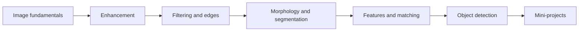

# Course Dependency Map

This map was built to organize the materials into a clean learning progression. The file names suggest six lecture blocks (`c1` to `c6`) and four TP statements, so the repository follows the most likely curriculum flow used in a classical Computer Vision course.

## Foundational Layer

- Image acquisition, sampling, and quantization
- Image representation, grayscale vs color, and pixel geometry
- Display, normalization, and basic image operations

## Enhancement Layer

- Intensity transformations
- Histogram analysis and equalization
- Contrast stretching and gamma correction
- Noise reduction by linear and non-linear filtering

## Feature-Extraction Layer

- Gradient operators
- Edge detection
- Binary morphology
- Shape, contour, and region analysis

## Segmentation Layer

- Thresholding
- Connected components
- Region-based segmentation
- Watershed-style separation of touching objects

## Recognition Layer

- Local features and descriptors
- Feature matching and correspondence
- Object detection concepts
- Face detection as a practical entry point

## TP Mapping

- TP1: image fundamentals, display, and point-wise operations
- TP2: histogram processing, filtering, and edge detection
- TP3: thresholding, morphology, and segmentation
- TP4: feature extraction, matching, and detection

## Repository Progression

