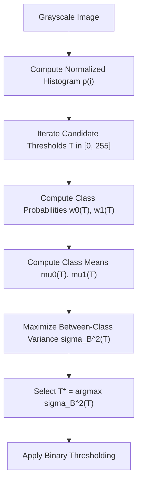

# Study Guide 03: Image Segmentation & Mathematical Morphology

## 1. Classical Image Segmentation Principles

Image segmentation partitions an image space $\Omega$ into $K$ disjoint, contiguous regions $\{R_1, R_2, \dots, R_K\}$ such that:

$$\bigcup_{i=1}^K R_i = \Omega, \quad R_i \cap R_j = \emptyset \quad \forall i \neq j$$

where each region $R_i$ satisfies a spatial or radiometric homogeneity predicate $P(R_i) = \mathrm{True}$.

---

## 2. Thresholding & Otsu's Criterion

Binarization maps a grayscale intensity array $f(x, y)$ into a binary decision map $g(x, y) \in \{0, 1\}$:

$$g(x, y) = \begin{cases} 1 & \text{if } f(x, y) \ge T \\ 0 & \text{if } f(x, y) < T \end{cases}$$

### Otsu's Between-Class Variance Derivation

Given normalized histogram $p(i) = \frac{n_i}{N}$ for $i \in [0, L-1]$:
1. **Class Probabilities:**
   $$\omega_0(T) = \sum_{i=0}^{T} p(i), \quad \omega_1(T) = \sum_{i=T+1}^{L-1} p(i) = 1 - \omega_0(T)$$

2. **Class Means:**
   $$\mu_0(T) = \frac{1}{\omega_0(T)} \sum_{i=0}^T i \cdot p(i), \quad \mu_1(T) = \frac{1}{\omega_1(T)} \sum_{i=T+1}^{L-1} i \cdot p(i)$$

3. **Global Mean:**
   $$\mu_T = \omega_0(T)\mu_0(T) + \omega_1(T)\mu_1(T) = \sum_{i=0}^{L-1} i \cdot p(i)$$

4. **Between-Class Variance Criterion:**
   $$\sigma_B^2(T) = \omega_0(T) (\mu_0(T) - \mu_T)^2 + \omega_1(T) (\mu_1(T) - \mu_T)^2 = \omega_0(T) \omega_1(T) [\mu_0(T) - \mu_1(T)]^2$$

The optimal global threshold $T^*$ is obtained via exhaustive evaluation in $\mathcal{O}(L)$ steps:

$$T^* = \arg\max_{0 \le T < L} \sigma_B^2(T)$$

---

## 3. Mathematical Morphology (Set-Theoretic Operations)

Let $A \subseteq \mathbb{Z}^2$ denote the binary foreground image set and $B \subseteq \mathbb{Z}^2$ denote the structuring element (kernel) with origin at $(0, 0)$.

### Fundamental Operators

| Operation | Mathematical Definition | Geometric Effect |
| :--- | :--- | :--- |
| **Erosion** | $A \ominus B = \{ z \in \mathbb{Z}^2 \mid (B)_z \subseteq A \}$ | Shrinks foreground; strips boundaries; eliminates small protrusions. |
| **Dilation** | $A \oplus B = \{ z \in \mathbb{Z}^2 \mid (\hat{B})_z \cap A \neq \emptyset \}$ | Expands foreground; bridges fractures; fills narrow valleys. |
| **Opening** | $A \circ B = (A \ominus B) \oplus B$ | Idempotent filter ($A \circ B \subseteq A$). Eliminates thin spurs & isolated noise. |
| **Closing** | $A \bullet B = (A \oplus B) \ominus B$ | Idempotent filter ($A \subseteq A \bullet B$). Fills small holes & bridges splits. |
| **Morphological Gradient** | $\mathrm{Grad}(A) = (A \oplus B) - (A \ominus B)$ | Extracts thin perimeter boundary of thickness equal to $B$. |
| **White Top-Hat** | $\mathrm{WTH}(A) = A - (A \circ B)$ | Extracts bright elements smaller than $B$. |
| **Black Hat** | $\mathrm{BTH}(A) = (A \bullet B) - A$ | Extracts dark elements smaller than $B$. |

---

## 4. Marker-Controlled Watershed Segmentation

Used to separate touching or coalesced convex shapes (e.g. cells, coins):

### Steps:
1. **Distance Transform:** $D(p) = \min_{q \in \mathrm{Background}} \|p - q\|_2$.
2. **Seed Extraction:** Prominent distance peaks represent unambiguous component centers (Sure Foreground).
3. **Topological Inundation:** Floods the inverted distance landscape from seed basins. When water levels from adjacent distinct basins meet, a watershed ridge line is erected, separating touching items without manual cut planes.
