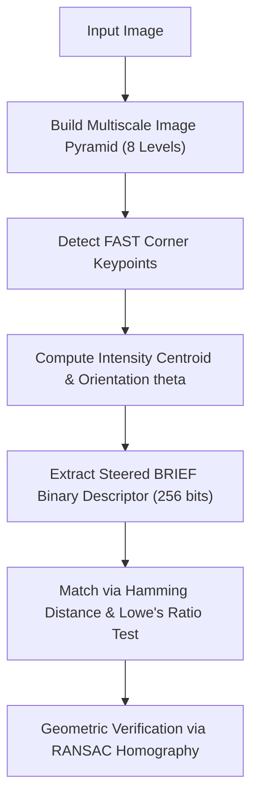

# Study Guide 04: Features, Descriptors & Correspondence Matching

## 1. Interest Point / Corner Detection

Interest points are localized 2D features exhibiting significant intensity variation across two orthogonal spatial directions.

### A. Harris Corner Detector
Computes the second-moment autocorrelation structure tensor $M$:

$$M(x, y) = \sum_{(u, v) \in W} w(u, v) \begin{bmatrix} I_x^2(u, v) & I_x(u, v) I_y(u, v) \\ I_x(u, v) I_y(u, v) & I_y^2(u, v) \end{bmatrix} = \begin{bmatrix} A & C \\ C & B \end{bmatrix}$$

where $w(u, v)$ is a Gaussian spatial weighting window.

The eigenvalues $\lambda_1, \lambda_2$ of $M$ characterize the local topology:
- **Flat region:** $\lambda_1 \approx 0, \lambda_2 \approx 0$.
- **Edge:** One eigenvalue large, one small ($\lambda_1 \gg \lambda_2 \approx 0$).
- **Corner:** Both eigenvalues significantly positive ($\lambda_1 \gg 0, \lambda_2 \gg 0$).

#### Harris Response Function:
Avoids explicit eigenvalue factorization using matrix invariants:

$$R = \det(M) - k \cdot (\mathrm{trace}(M))^2 = (\lambda_1 \lambda_2) - k \cdot (\lambda_1 + \lambda_2)^2, \quad k \in [0.04, 0.06]$$

### B. Shi-Tomasi (Good Features to Track)
Directly monitors the minimum eigenvalue:

$$R = \min(\lambda_1, \lambda_2) \ge \lambda_{\mathrm{min}}$$

Guarantees high numerical conditioning for Lucas-Kanade optical flow tracking.

---

## 2. ORB (Oriented FAST & Rotated BRIEF)

ORB (Rublee et al., 2011) is a patent-free, high-performance binary feature pipeline designed as an alternative to SIFT/SURF.

### 1. Multi-Scale Oriented FAST Keypoints
- Constructs an 8-level image pyramid with decimation scale factor $\alpha = 1.2$.
- Applies FAST-9 (evaluates 9 contiguous pixels on a 16-pixel Bresenham circle).
- Measures the **Intensity Centroid** to establish keypoint orientation $\theta$:
  $$m_{pq} = \sum_{x, y \in r} x^p y^q I(x, y)$$
  $$C = \left( \frac{m_{10}}{m_{00}}, \frac{m_{01}}{m_{00}} \right) \implies \theta = \mathrm{arctan2}(m_{01}, m_{10})$$

### 2. Rotated BRIEF (rBRIEF) Binary Descriptors
- BRIEF constructs a 256-bit binary string from intensity tests over point pairs $(x_i, y_i)$:
  $$\tau(p; x, y) = \begin{cases} 1 & \text{if } I(p + x) < I(p + y) \\ 0 & \text{otherwise} \end{cases}$$
- rBRIEF steers each coordinate pair by orientation angle $\theta$:
  $$\begin{bmatrix} x_i' \\ y_i' \end{bmatrix} = R_\theta \begin{bmatrix} x_i \\ y_i \end{bmatrix}, \quad R_\theta = \begin{bmatrix} \cos\theta & -\sin\theta \\ \sin\theta & \cos\theta \end{bmatrix}$$

---

## 3. Matching Metrics & Robust Filtering

### A. Hamming Distance
Comparing two 256-bit descriptors $a, b \in \{0, 1\}^{256}$ is computed via bitwise XOR and hardware population count:

$$d_H(a, b) = \mathrm{popcount}(a \oplus b)$$

Executes in single CPU clock cycle instructions (`POPCNT`), enabling real-time matching at hundreds of frames per second.

### B. Lowe's Ratio Test
Ambiguous matches in repetitive textures are rejected by comparing the top 2 nearest neighbors:

$$\frac{d(f_q, f_{\mathrm{nn1}})}{d(f_q, f_{\mathrm{nn2}})} < \tau \quad (\tau \approx 0.75)$$

### C. RANSAC Homography Estimation
Fits a 2D Projective Homography matrix $H \in \mathbb{R}^{3 \times 3}$:

$$s \begin{bmatrix} x' \\ y' \\ 1 \end{bmatrix} = \begin{bmatrix} h_{11} & h_{12} & h_{13} \\ h_{21} & h_{22} & h_{23} \\ h_{31} & h_{32} & h_{33} \end{bmatrix} \begin{bmatrix} x \\ y \\ 1 \end{bmatrix}$$

Iteratively draws 4 minimal correspondence pairs to establish geometric inliers and reject background mismatches.

---

## 4. Feature Descriptor Comparison

| Feature Method | Descriptor Type | Descriptor Size | Rotation Invariance | Scale Invariance | Speed / Compute |
| :--- | :--- | :--- | :--- | :--- | :--- |
| **SIFT** | Floating Point (Gradient Hist) | 128 floats (512 B) | Full ($\pm \pi$) | Full (DoG Pyramid) | Heavy ($\sim 15$ FPS) |
| **SURF** | Floating Point (Haar Wavelet) | 64 floats (256 B) | Full ($\pm \pi$) | Full (Integral Box) | Moderate ($\sim 30$ FPS) |
| **ORB** | Binary (Steered rBRIEF) | 32 bytes (256 bits) | Full (Centroid $\theta$) | Multiscale Pyramid | Ultra-Fast ($> 100$ FPS) |
| **FAST** | Detector Only | N/A | None | None | Instantaneous |
